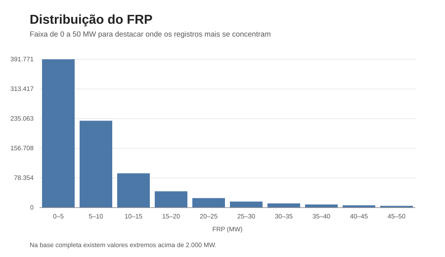
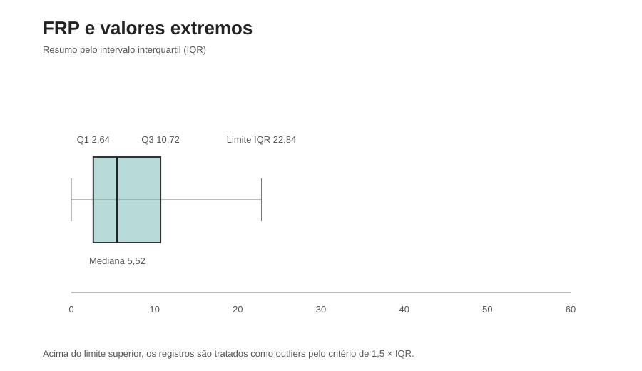
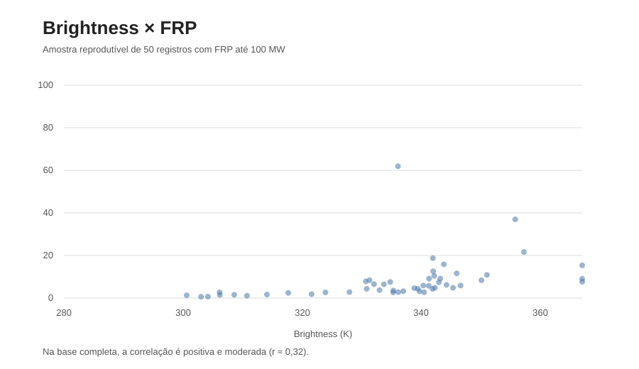
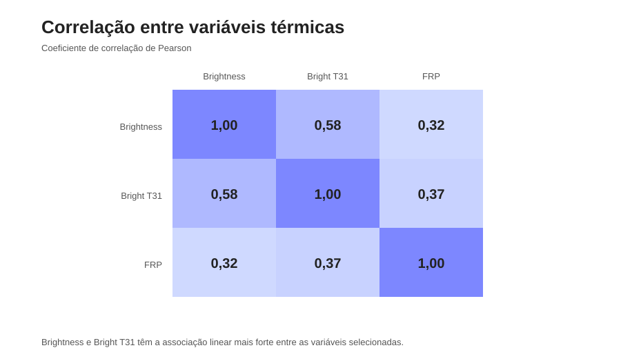

# 🔥 Análise de Queimadas no Brasil com Dados de Satélite da NASA

Neste projeto analisei focos de calor detectados por satélites da NASA no território brasileiro usando Python, estatística descritiva e análise exploratória de dados.

Trabalhei com uma base de mais de 850 mil registros para entender melhor a intensidade dos focos, a distribuição dos valores e as relações entre algumas das variáveis térmicas.

## 📌 Sobre o projeto

Incêndios florestais geram impactos ambientais, sociais e econômicos, afetando biodiversidade, agricultura, saúde pública e populações próximas às regiões atingidas.

Usei dados da plataforma NASA FIRMS/Earthdata para investigar os focos de calor registrados no Brasil durante o período analisado.

**Período analisado:** 25/05/2025 a 25/05/2026  
**Total analisado:** 853.047 registros de focos de incêndio

## 🎯 Objetivos

- Realizar limpeza e preparação dos dados;
- Aplicar técnicas de estatística descritiva;
- Analisar medidas de tendência central e dispersão;
- Investigar quartis e percentis;
- Detectar valores extremos utilizando o método IQR;
- Analisar a distribuição da intensidade dos incêndios;
- Investigar relações entre variáveis térmicas;
- Criar visualizações para facilitar a interpretação dos resultados;
- Extrair insights relevantes a partir dos dados.

## 🛠️ Tecnologias utilizadas

- Python
- Pandas
- NumPy
- Matplotlib
- Seaborn
- Google Colab
- Jupyter Notebook

## 📊 Principais variáveis

- `latitude` e `longitude` — localização geográfica;
- `brightness` — brilho térmico detectado pelo satélite;
- `bright_t31` — temperatura registrada pelo sensor infravermelho;
- `frp` — Fire Radiative Power, indicador da potência radiativa do fogo;
- `acq_date` e `acq_time` — data e horário da detecção;
- `daynight` — identificação de registros diurnos e noturnos;
- `satellite` — satélite responsável pela detecção;
- `confidence` — nível de confiança da detecção.

## 🔎 Etapas da análise

### 1. Preparação dos dados

A base foi inspecionada para identificar sua estrutura, valores ausentes, possíveis registros duplicados e necessidades de padronização.

### 2. Estatística descritiva

Foram analisadas medidas como média, mediana, moda, desvio padrão, amplitude, coeficiente de variação, quartis e percentis.

### 3. Detecção de outliers

Foi utilizado o método **IQR (Intervalo Interquartil)** para identificar valores extremos, principalmente na variável `frp`.

### 4. Visualização dos dados

Foram utilizados histogramas, boxplots, gráficos de barras, scatterplots e heatmap de correlação para explorar os dados e comunicar os resultados.

## 📈 O que os dados mostraram

Uma das coisas que mais chamou minha atenção durante a análise foi a diferença entre a média do FRP (**10,86 MW**) e a mediana (**5,52 MW**). Isso acontece porque a maior parte dos registros está concentrada em valores menores, enquanto alguns focos muito intensos puxam a média para cima. O maior valor encontrado passou de **2.000 MW**.

### Distribuição do FRP



O histograma deixa essa concentração bem visível. A maior parte dos focos está nas primeiras faixas de FRP e a frequência cai rapidamente conforme a potência aumenta.

### Valores extremos



Pelo critério de IQR, o limite superior ficou em aproximadamente **22,84 MW**. A partir daí aparecem muitos valores considerados outliers. Nesse caso, eles não são simplesmente "erros": são registros importantes porque representam eventos bem mais intensos que o comportamento típico da base.

### Brightness × FRP



Também quis verificar se focos com maior brilho térmico tendiam a apresentar maior potência radiativa. Na base completa, `brightness` e `frp` tiveram correlação de aproximadamente **0,32**. Existe uma relação positiva, mas ela não é forte o suficiente para tratar uma variável como explicação isolada da outra.

### Correlação entre as variáveis térmicas



Entre as variáveis analisadas, a relação mais forte apareceu entre `brightness` e `bright_t31`, com correlação próxima de **0,58**. Já `bright_t31` e `frp` apresentaram aproximadamente **0,37**.

## 🌎 Aplicação dos dados

Além da parte estatística, o projeto me ajudou a entender como dados de satélite podem ser usados em situações como:

- Monitoramento ambiental;
- Identificação de eventos extremos;
- Análise de padrões de queimadas;
- Apoio a estudos de prevenção de desastres;
- Geração de informações para tomada de decisão.

Foi uma forma prática de trabalhar com uma base real e de grande volume, passando pela preparação dos dados, análise estatística e comunicação dos resultados.

## ⚠️ Limitações

Os dados representam focos de calor detectados por sensores de satélite. Portanto, a análise permite identificar padrões nos registros e em seus indicadores térmicos, mas não determina diretamente a causa específica de cada incêndio.

## 📁 Estrutura do projeto

```text
nasa-brazil-wildfires-analysis/
│
├── README.md
├── notebooks/
│   └── nasa_wildfires_analysis.ipynb
│
├── data/
│   └── README.md
│
└── images/
    └── visualizações da análise
```

## 🎓 Contexto acadêmico

Desenvolvi este projeto durante a graduação em **Engenharia de Software na FIAP**, aplicando conceitos de Data Science, estatística e análise exploratória em uma base de dados real.

## 📚 Fonte dos dados

Os dados utilizados foram obtidos através da plataforma **NASA FIRMS (Fire Information for Resource Management System)**.

Devido ao tamanho da base original, o arquivo CSV não será armazenado diretamente neste repositório. As instruções para obtenção e utilização dos dados estão na pasta `data/`.
